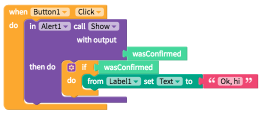
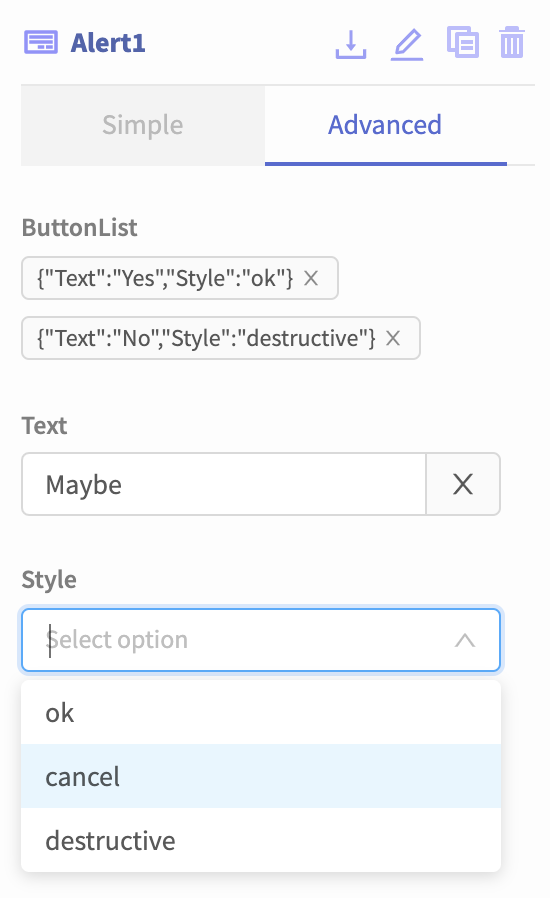
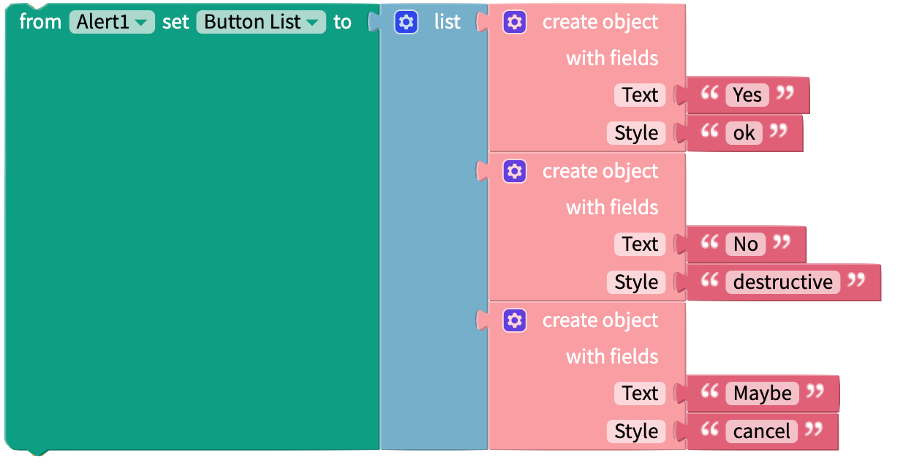
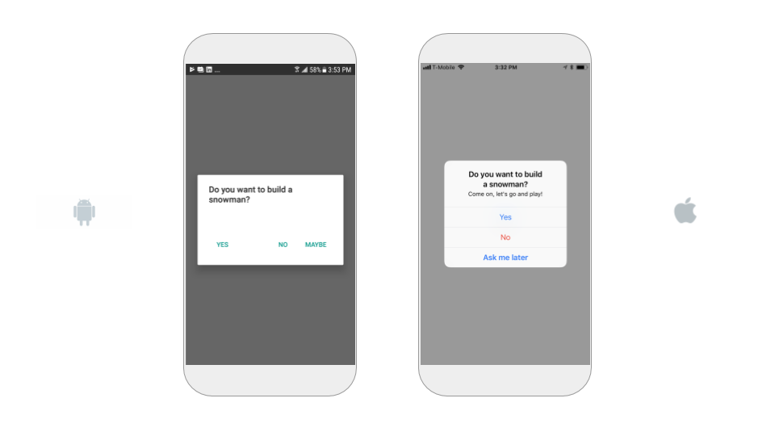
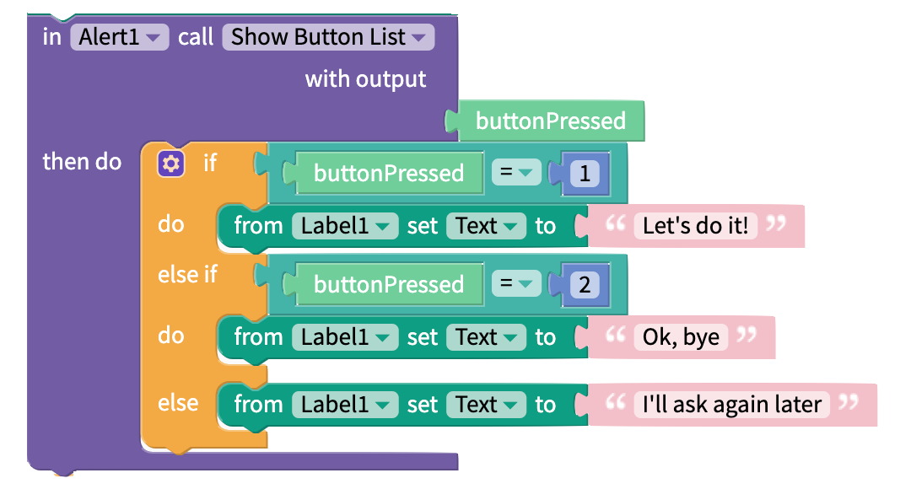

# Alerts

Alerts are useful components for displaying important messages while users are in the app itself

## One Button Alert

A one button alert, also known as a notification, displays a message and one button to confirm user has viewed the message

To set up an alert, simply fill in the following `simple` properties. The Cancel Button Text only needs to be filled out for a two-button alert. You can use blocks to start an event when

| Property | Description |
| :--- | :--- |
| Title | The title of the alert |
| Message | The subtitle of the alert |
| Confirm Button Text | The text of the button |
| Cancel Button Text | `LEAVE BLANK` |

## Two button alert

Two button alerts have two buttons, one that dismisses the notification and one that can be programmed to start an event

To set one up, simply add the following `simple` properties

| Property | Description |
| :--- | :--- |
| Title | The title of the alert |
| Message | The subtitle of the alert |
| Confirm Button Text | The text of the right confirm button; If the `danger` switch is turned on, the text will be in red \(iOS only\) |
| Cancel Button Text | The text of the left cancel button |

If you want to start an event from a confirm button, you will want to add the blocks below:

## Button List: Alert with three or more buttons

It is possible to add buttons to an alert for more sophisticated use cases.  
This can be done in the `Advanced` properties of the Alert in the Design tab.  
It can also be done using the `set Button List to` block by creating a [list](lists.md) of [objects](objects.md).

On iOS, the Alert can show more than 3 Buttons.  
On Android, the Alert can show up to 3 buttons. If more than 3 buttons are specified, the first 3 will be shown.   

| Property | Description |
| :--- | :--- |
| Title | The title of the alert |
| Message | The subtitle of the alert |
| Text `Advanced` | The text of the button |
| Style `Advanced` | The style of the button; `ok` is a confirm button, `cancel` is a cancel button and `destructive` is a confirm button with text in red \(iOS only\) |

The 'showButtonList' block will return an output called 'buttonPressed'.  
This will return the position of the Button in your Button List.  
You can take some action based on which button was pressed.

