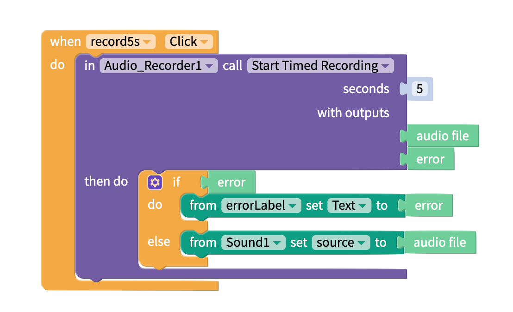
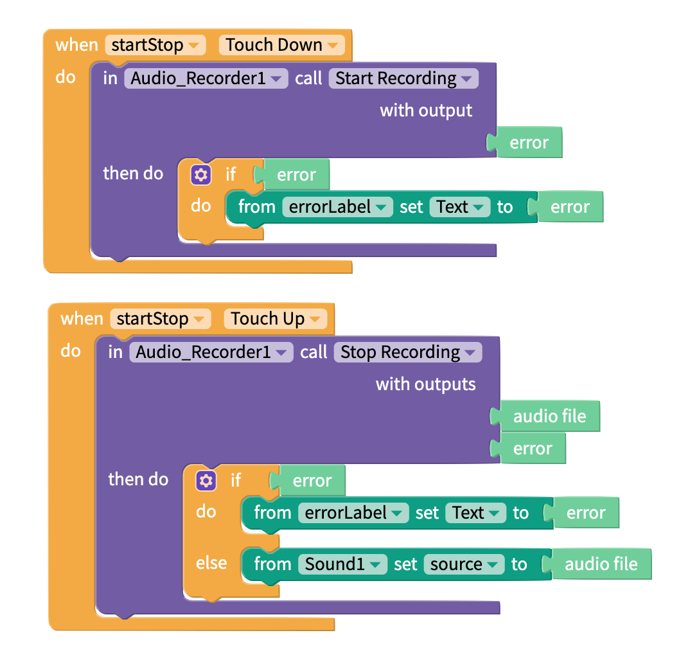

# Audio Recorder

* [Timed audio recording](audio-recorder.md#timed-audio-recording)
* [Start and Stop recording audio](audio-recorder.md#start-and-stop-recording)
* [Using your Audio file](audio-recorder.md#using-your-audio-file)

## Timed Audio Recording

This block allows you to record audio for a fixed length of time.

| Inputs | Data type | Function |
| :--- | :--- | :--- |
| seconds | Number | Specify how many seconds to record audio |

| Outputs | Data type | Function |
| :--- | :--- | :--- |
| audio file | Audio | Returns recorded audio |
| error | Text | If there is an error, returns the error \(else returns `null`\) |

## Start and Stop Recording

These blocks allow you to record for an unspecified amount of time.

This is an example of how you can use the 'Start Recording' and 'Stop Recording' blocks in your app. These blocks are for a single 'Start/Stop Recording' button. When the user presses down on the button, the app starts recording audio. When the user releases the button, the app stops recording audio.

<table>
  <thead>
    <tr>
      <th style="text-align:left">Outputs</th>
      <th style="text-align:left">Data Type</th>
      <th style="text-align:left">Function</th>
    </tr>
  </thead>
  <tbody>
    <tr>
      <td style="text-align:left">audio file</td>
      <td style="text-align:left">
        
.mp4 (on device)

        
webm (on web)

      </td>
      <td style="text-align:left">Returns recorded audio</td>
    </tr>
    <tr>
      <td style="text-align:left">error</td>
      <td style="text-align:left">Text</td>
      <td style="text-align:left">If there is an error, returns the error (else returns <code>null</code>)</td>
    </tr>
  </tbody>
</table>

## Using your Audio File

You can play the recorded audio in your app with the [Sound](sound.md) component.

You can save your audio file online with the [Cloudinary Media DB.](media-db.md)   
When you have a URL for your file from Cloudinary, you can save it to a [Firebase Realtime DB](realtime-db.md) or an [Airtable DB](spreadsheet.md). You can also share the URL for your audio file with other people using our [Share](share.md) component.

