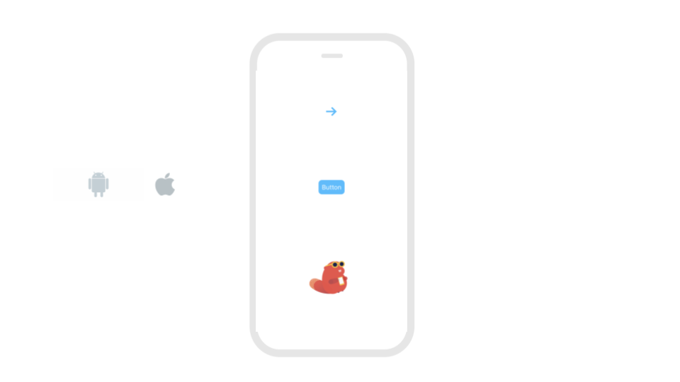
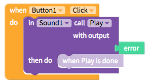

# Button

A button is just something you can click on to perform an action. This action can be anything from navigating to a different screen, saving information to a database, or playing a sound.

* [Style the Button](button.md#style-the-button)
* [Edit the Button size](button.md#edit-the-button-size)
* [Programming the Button](button.md#start-an-event-from-a-button-click)

## Style the Button

You have many options for styling your button, such as changing the background color or text color. Here are the different options for customization:

* **Text:** Text that appears on the button
* **Text Color:** Color of the text that appears on the button
* **Background Color:** Sets the background color of the button
* **Font Size:** Size of the text that appears on the button
* **Background Picture:** Upload a picture that appears on the button. ****
* **Background Picture Resize Mode**
  * **Cover:** Fills the entire button without changing the height and width ratio of the image
  * **Contain:** The entire image will be scaled down to fit inside the button, without changing the height and width ratio of the image
  * **Stretch:** The image's height will change to fill the button length-wise
  * **Repeat:** Repeat the image to cover the button. The image's height and width ratio will not change
  * **Center:** Positions the image in the middle of the button
* **Visible:** To see the button in your app, set the switch to true
* **Border**
  * **Width:** Enter how wide you want the border outline of the button to be
  * **Color:** Pick a color for the border of the button
  * **Style:** Select if you want the border to be a dotted, dashed or solid line
  * **Radius:** Enter how round you want the edges of the border for the button to be
* **Font Bold:** To make the text on the button bold, set the switch to true
* **Font Italic:**  To make the text on the button italic, set the switch to true
* **Raised:** To cast a shadow around the button, set the switch to true
* **Disabled:** To prevent the button from performing an option when it is clicked, set the switch to true

## Edit the Button size

You can set how tall the button is using the height property and set how wide the button is using the width property.

**Height**

* **Fill container -** The button fills the entire screen vertically
* **Fit contents -** The  button’s height changes to be the size of the contents it contains
* **Relative size -** The button fills the specified percentage of the screen
* **Absolute size -** Sizes the button to a specified number of pixels

**Width**

* **Fill container -** The button fills the entire screen horizontally
* **Fit contents -** The button’s width changes to be the size of the contents it contains
* **Relative size -** The button fills the specified percentage of the screen
* **Absolute -** Sizes the button to a specified number of pixels

## Add Spacing

You change the spacing and positioning of the button with the Margin and Padding properties.   
**Margin**

* You can specify how much space you want between the edges of the button and the screen using either pixel or percent values.

**Padding**

* You can specify how much space you want between the border and contents of the button using either pixel or percent values.

## Programming the Button

You can use the following properties to pick when an event will occur:

* **Click:** Performs an action when the user taps the button
* **Long Click:** Performs an action when the user hold the button down
* **Touch Up:** Performs an action after the user releases the button
* **Touch Down:** Performs an action after the user gently touches the button

