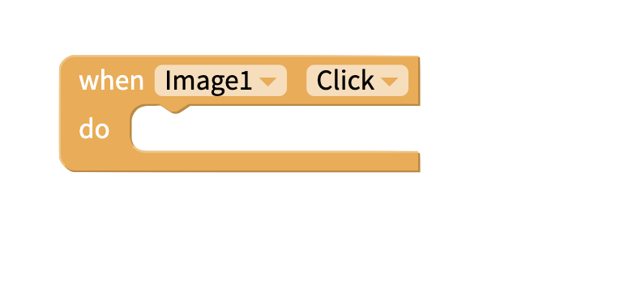

# Label

* [Style the Label](label.md#style-the-label)
* [Edit the Label size](label.md#edit-the-label-size)
* [Add spacing](label.md#add-spacing)

## Style the Label

You can customize your label using the following properties: 

* **Text:** Text that appears on the label
* **Font Size:** Size of the text that appears on the label
* **Color:** Color of the text that appears on the label
* **Background Color:** Sets the background color of the label
* **Font Style**
  * **Normal:** Default text display
  * **Italic:** Display the text in italics
* **Font Weight:** Select how bold the text on the label will be
* **Text Align**
  * **Auto -** Aligns the text automatically
  * **Left -** Displays the text starting from the left of the label
  * **Right -** Displays the text starting from the right of the label
  * **Center -** Displays the text starting from the middle of the label
  * **Justify -** Aligns both the right and left side of the text equally
* **Visible:** To see the label in your app, set the switch to true
* **Border**
  * **Width:** Enter how wide you want the border outline of the label to be
  * **Color:** Pick a color for the border of the label
  * **Style:** Select if you want the border of the label to be a dotted, dashed or solid line
  * **Radius:** Enter how round you want the edges of the border for the label to be

## Edit the Label size

You can set how tall the label is using the height property and set how wide the label is using the width property.

**Height**

* **Fill container -** The label fills the entire screen vertically
* **Fit contents -** The  label’s height changes to be the size of the contents it contains
* **Relative size -** The label fills the specified percentage of the screen
* **Absolute size -** Sizes the label to a specified number of pixels

**Width**

* **Fill container -** The label fills the entire screen horizontally
* **Fit contents -** The  label’s width changes to be the size of the contents it contains
* **Relative size -** The label fills the specified percentage of the screen
* **Absolute -** Sizes the label to a specified number of pixels

_Note: If the text in your label is more than a single line, we recommend that you set the Height to `Fit contents`_

## Add spacing

You change the spacing and positioning of the label with the Margin and Padding properties. 

**Margin**

* You can specify how much space you want between the edges of the label and the screen using either pixel or percent values.

**Padding**

* You can specify how much space you want between the border and contents of the label using either pixel or percent values.

## Events

### Click

This event handler is fired when the user clicks on the image.

## Properties

### Computed Dimensions

The `Computed Height` and `Computed Width` blocks return the on screen dimensions of the label, after it has been rendered on screen. The value returned is an integer, representing the size in pixels.

### Height 

The set and get height blocks work with the Height property of the image component. Acceptable input values are. 

* Number of Pixels
* Percentage Height
* "Fit Contents"
* "Fill Container"

### Picture 

The set and get picture blocks work with picture property of the image component. Pictures can be uploaded as local assets or specified as URLs 

### Resize Mode 

The set and get resize mode blocks work with how the picture is scaled within the image component. Acceptable values are:

* Cover
* Contain
* Stretch
* Repeat
* Center

### Visible 

The set and get visible blocks are used to show or hide the entire image component. Acceptable values are:

* True
* False

### Width

  
The set and get width blocks work with the Width property of the image component. Acceptable values are.‌

* Number of Pixels
* Percentage Width
* "Fit Contents"
* "Fill Container"

