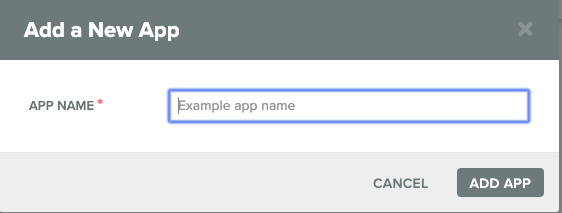
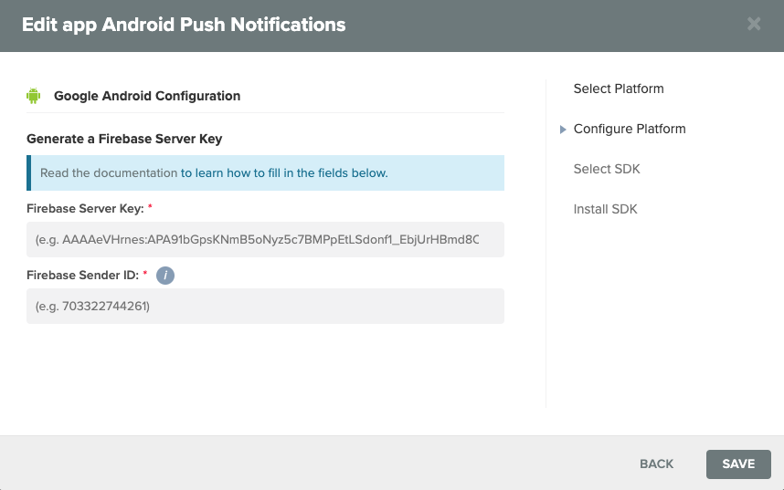
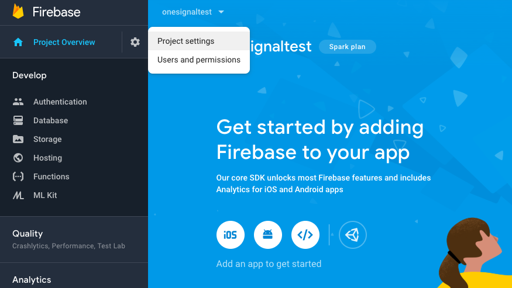
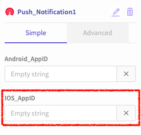
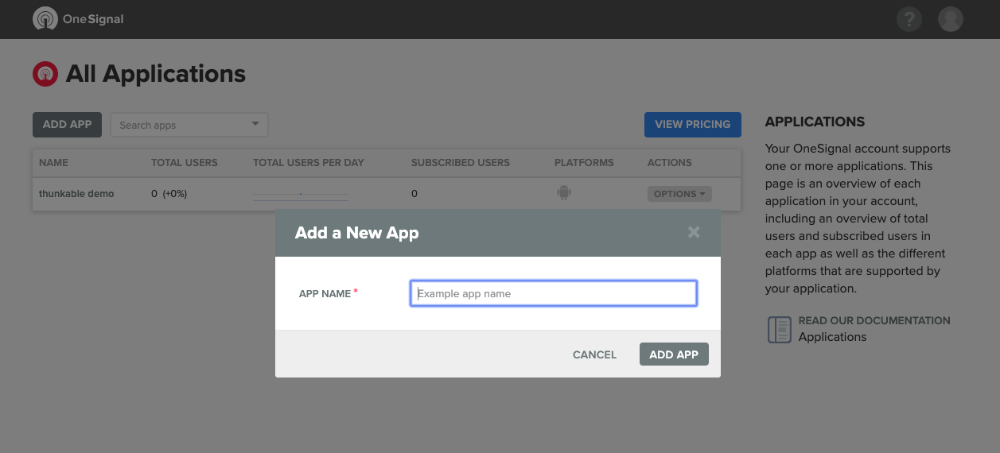
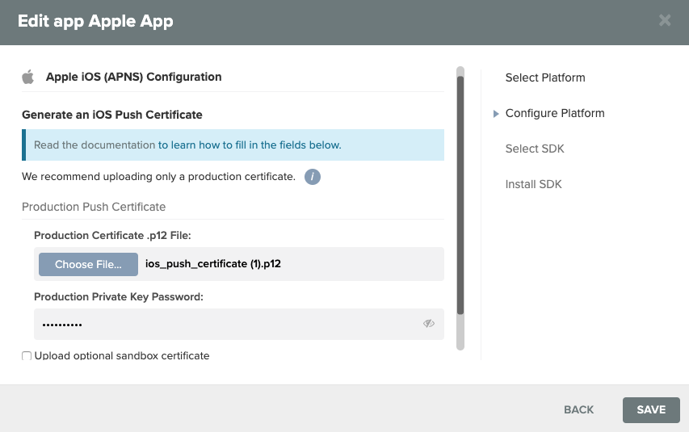
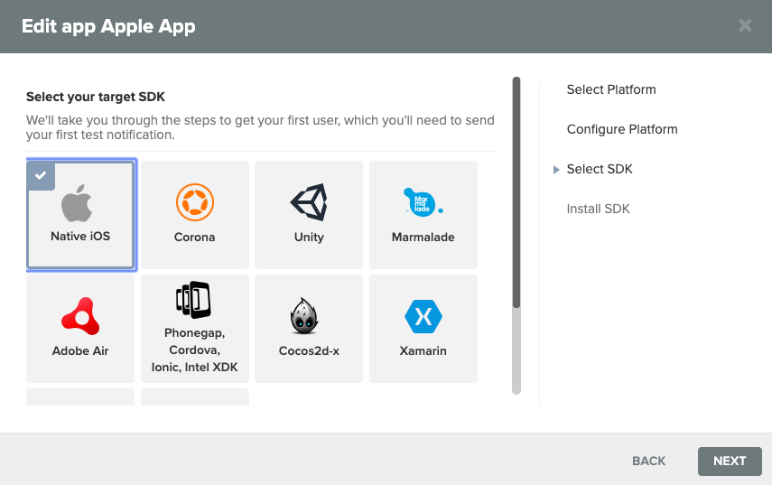

# Push Notifications by One Signal

Push notifications are one of the biggest advantages that mobile apps have over their mobile website counterparts since they can send a message to a user without an app being open. However, annoying notifications, those that are irrelevant and too frequent, can be dismissed or blocked easily so we highly recommend sending notifications only when the content is relevant to the user.

| App type | Frequency | Content |
| :--- | :--- | :--- |
| E-commerce | Sales | Coupon code |
| Game | App updates | Try this new level |


**Push Notifications are a**  **component.** While all Thunkers can add Push Notifications to their app projects and live test them in their apps, only PRO Thunkers can download and publish apps with Push Notifications.


Most of the work you do to use push notifications in your app will be on the One Signal interface. On Thunkable, you simply drag and drop the component in and add the One Signal Android and/or iOS key\(s\).

## Sign up with One Signal

One Signal is a free service that supports unlimited devices and notifications. They make money by selling your users' data to 3rd parties.

* Go to [One Signal](https://onesignal.com/) and sign up for an account
* Add a new app

After you have added a new app, you'll likely see a screen like the one below:

When you create a new OneSignal project it asks you what platform your want to use. From this dialog choose "Android".

Thunkable currently supports Apple iOS and Google Android.

## Android Set Up

Setting up push notifications for Android is relatively straightforward. Here's a quick overview of the steps, followed by a more detailed walk-through.

1. [Select Your Platform](push-notifications-by-one-signal.md#1-choose-the-android-platform)
2. [Configure Your Platform](push-notifications-by-one-signal.md#2-set-up-a-firebase-project)
3. [Select Your SDK](push-notifications-by-one-signal.md#3-select-your-sdk)
4. [Install Your SDK](push-notifications-by-one-signal.md#5-install-your-sdk)

### 1. Select Your Platform

After you have given your app a name you will be asked to select which platform you would like to use. From this dialog, choose **Google Android** and click Next.

### 2. Configure Your Platform

When configuring your platform you will be prompted for a **Firebase Server Key** and a **Firebase Sender ID.** As these names imply, you will need a Firebase account to provide this information.

We have more extensive documentation on setting up a Firebase account, if you don't have one already you can read that [here](realtime-db.md#set-up-your-own-firebase-account).

Once you have created a new project click on the gear icon beside Project Overview and open your **Project settings**.

In your project settings, click on the **Cloud Messaging** tab where you can find both your server key and sender ID. Copy both of these and go back to OneSignal.

### 3. Select Your SDK

The last thing you need to do in OneSignal is choose your target SDK. Select **Native Android** and click next to continue. 

### 4. Install Your SDK

Copy the alpha numeric code that OneSignal Generates called **Your App ID** in the image below.

Paste this ID into your Thunkable project and download your .apk. You're now ready to start sending Push Notifications to your Android users.

##  iOS Set Up

Setting up push notifications involves a few more steps on iOS than on Android, but every step is covered in detail below. 

1. [Select Platform](push-notifications-by-one-signal.md#1-select-platform)
2. [Configure Platform](push-notifications-by-one-signal.md#2-configure-platform)
3. [Select SDK](push-notifications-by-one-signal.md#3-select-sdk)
4. [Install SDK](push-notifications-by-one-signal.md#4-install-sdk)

### 1. Select Platform

Get started by creating a new app. You need to do this even if your Thunkable project is intended for both iOS and Android. 

After that, choose **Apple iOS** as your platform.

### 2. Configure Platform

OneSignal have provided [extensive documentation](https://documentation.onesignal.com/docs/generate-an-ios-push-certificate) on how to find your **Production Certificate .p12 file** as well as your **Production Private Key Password**. The most important steps are outlined below.

To begin, open the [OneSignal Provisionator](https://onesignal.com/provisionator) webpage. This tool will generate a .p12 file and the accompanying password for you.

Follow the on screen instructions. Enter your Apple Developer ID and password. This portal works with 2FA enabled as well. If prompted, enter your 2FA code. Choose your team and the relevant Bundle ID and click generate. 


You must be a Team Administrator to generate the files


You can now download the .p12, .cer and .pem files that are generated for you.


Don't forget to save your password somewhere safe.


Click on **Apple iOS** 

With that completed you can upload your .p12 file and enter the password in OneSignal. Click **Save** to proceed to the next step.

### 3. Select SDK

Click on **Native iOS**  to choose the SDK you wish to target. Then click **Next** to generate your App ID.

### 4. Install SDK

Copy the alpha-numeric code labeled **Your App ID** and head back to Thunkable.

Paste your ID in the **IOS\_AppID** field and you're almost done. In order to now publish your app your will have to create a .mobileprovision profile. You can find details of how to do this on the ["Publish to App Store" page](publish-to-app-store-ios.md#adding-push-notifications).

