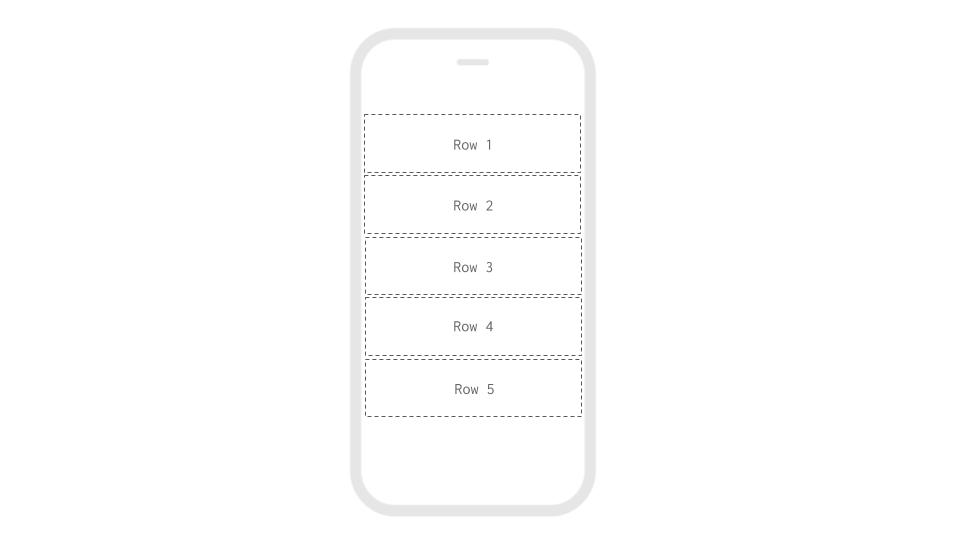

# Row

* [Set the size of the row](row.md#set-size-of-the-row)
* [Space the elements horizontally](row.md#space-the-elements-horizontally)
* [Space the elements vertically](row.md#space-the-elements-vertically)
* [Add a background color or picture](row.md#add-a-background-color-or-picture)

## Set the size of the row

For more information on sizing in your app, please see our [introduction here​](intro-to-sizing.md)

| Property | Description |
| :--- | :--- |
| Height | Default \(`Fill container`\); `Fill container` sizes the row to fill the Screen or container that it is within. `Fit contents`  sizes the row to the size of its contents; `Relative size` size the row to a percent of the Screen or other container it is within; `Absolute size` sizes the row to a specific number of pixels |
| Width | Default \(`Fill container`\); `Fill container` sizes the row to fill the Screen or container that it is within. `Fit contents`  sizes the row to the size of its contents; `Relative size` size the row to a percent of the Screen or other container it is within; `Absolute size` sizes the row to a specific number of pixels |

## Space the elements horizontally

The `Horizontal Alignment` property allows you to space elements in a Row horizontally

## Space the elements vertically

The `Vertical Alignment` property allows you to space elements in a Row vertically

## Add a background color or picture

| Property | Description |
| :--- | :--- |
| Background Color | Default \(`none`\). Select any color using the color picker, RGBA or HEX value |
| Background Picture | You can upload a background image to your app or reference an image url e.g.`beaver-yellow.png` |
|  |  |

**Background Picture Resize Mode** 

* Cover: Fills the entire screen without changing the height and width ratio of the image 
* Contain: The entire image will be scaled down to fit inside the screen, without changing the height and width ratio of the image 
* Stretch: The image's height will change to fill the screen length-wise 
* Repeat: Repeat the image to cover the screen. The image's height and width ratio

   will not change    

* Center: Positions the image in the middle of the frame

