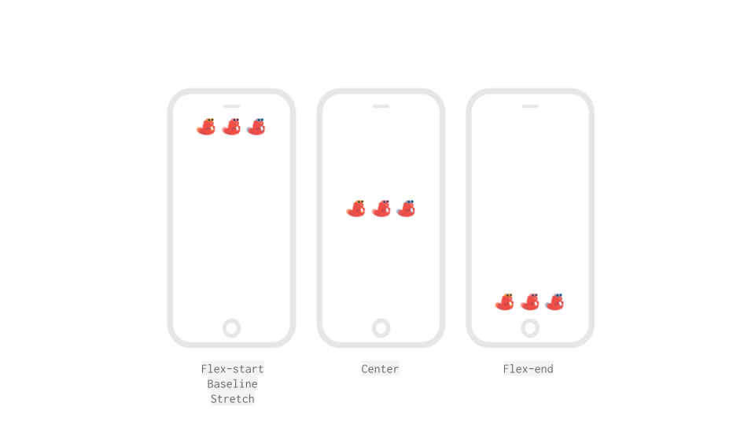

# Screen

## Understanding Screen Blocks 

When "Screen1 Starts"

| Event | Description |
| :--- | :--- |
| Starts | Triggers an event / set of events when the Screen is **first** opened |

| Event | Description |
| :--- | :--- |
| Opens | Triggers an event / set of events anytime the Screen is opened |

## Space elements horizontally

The `Horizontal Alignment` property allows you to space elements in a Screen horizontally

## Space elements vertically

The `Vertical Alignment` property allows you to space elements in a Screen vertically

## Add a background color or picture

| Property | Description |
| :--- | :--- |
| Background Color | Default \(`none`\). Select any color using the color picker, RGBA or HEX value |
| Background Picture | You can upload a background image to your app or reference an image url e.g.`beaver-yellow.png` |

## Background Picture Resize Mode

This determines how to resize the image when the frame doesn't match the raw image dimensions.

* Cover: Fills the entire screen without changing the height and width ratio of the image 
* Contain: The entire image will be scaled down to fit inside the screen, without changing the height and width ratio of the image 
* Stretch: The image's height will change to fill the screen length-wise 
* Repeat: Repeat the image to cover the screen. The image's height and width ratio

   will not change    

* Center: Positions the image in the middle of the frame

## Enable scrolling

| Property | Description |
| :--- | :--- |
| Scrollable | Default \(`false`\). Indicates whether the screen is scrollable. For scrollable to work, you must also set your screen height to `fit contents`  and the components in your screen must have heights set in `absolute` pixels |

## Hide \(or show\) status bar

| Property | Description |
| :--- | :--- |
| Show Status Bar | Default \(`true`\). If set to `false`, hides the top status bar |

## Set orientation

| Property | Description |
| :--- | :--- |
| Screen Orientation | Default \(`all`\). You can fix the screen orientation to `portrait` and `landscape` |

