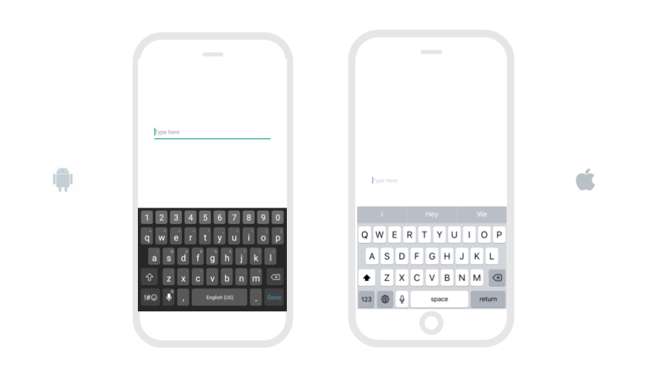
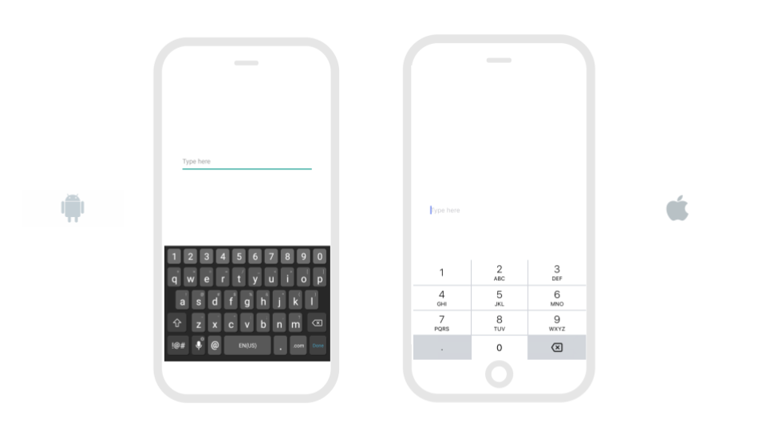
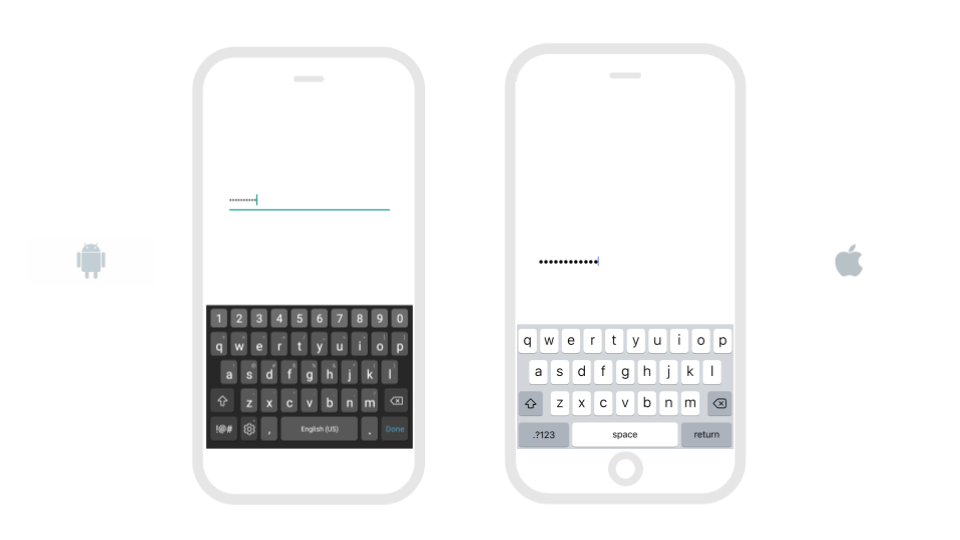

# Text Input

* [Set keyboard type](text-input.md#set-keyboard-type)
* [Set up for passwords](text-input.md#set-up-for-passwords)
* [Style the Text Input](text-input.md#style-the-text-input)
* [Edit the Text Input size](text-input.md#edit-the-text-input-size)
* [Add spacing](text-input.md#add-spacing)

## Set keyboard type

You can customize the Text Input to display the standard keyboard or to have it accept email addresses \(shown on Android phone on left\) or numbers \(shown on the iOS phone on the right\)

| Property | Description |
| :--- | :--- |
| Keyboard Type | Default \(`default`\); default is the default keyboard installed on the phone; numeric accepts numbers and is similar to `phone-pad`; `email-address` is customized to accept email addresses |

## Set up for passwords

You can also set up Text Input for passwords as shown below

| Property | Description |
| :--- | :--- |
| Secure Text Entry `Advanced` | Default \(`false`\); If true, replaces text with \* as users type |

## Style the Text Input

| Property | Description |
| :--- | :--- |
| Hint | Default \(`Type Here`\); Optional hint text that disappears when the user starts typing into the Text Input |
| Text | Default \(`none`\); Optional text that first appears in the Text Input |
| Color | Default \(`#007AFF`\); Color of the text that users type |
| Font Bold | Default \(`false`\); If `true`, text font will be **bold** |
| Font Italic | Default \(`false`\);  If `true`, text font will be _italic_ |
| Font Size | Default \(`14`\); Size of the text that users type |
| Background Color | Default \(`none`\); Sets the background color of the text box |
| Border | Default \(`none`\); You can set the `width`, `color` and `style` of the border around the Text Input box. On iOS, bordersor background colors can be useful to make the Text Input box more visible |
| Underline Color Android `Advanced` | Default \(`none`\); Sets the underline color of the Text Input on Android |

## Edit the Text Input size

We recommend that you set the Height of your Text Input to `Fit contents`

For more information on sizing in your app, please see our [introduction here​](intro-to-sizing.md)

| Property | Description |
| :--- | :--- |
| Height | Default \(`Fit contents`\); Four options: 1\) `Fit contents` which auto-sizes to the content size or 2\) `Fill container` which auto-sizes to the container 3\) `Relative size` in percent of Screen, 4\) `Absolute size` in pixels |
| Width | Default \(`80%`\); Four options: 1\) `Fit contents` which auto-sizes to the content size or 2\) `Fill container` which auto-sizes to the container 3\) `Relative size` in percent of Screen, 4\) `Absolute size` in pixels |

## Add spacing

For more information on adding spacing in your app, please see our [introduction here](intro-to-spacing.md)

To find the spacing properties, you'll have to select the `Advanced` tab

| Property | Description |
| :--- | :--- |
| Margin `Advanced` | Default \(`none`\); Margin is the space outside of the border of a component; You can set space on the `top`, `bottom`, `right` or `left` of the component in both pixels or percent of Screen |
| Padding `Advanced` | Default \(`none`\); Padding is the space between the contents and the border of a component; You can set space on the `top`, `bottom`, `right` or `left` of the component in both pixels or percent of Screen |

