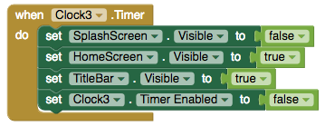

# Layout

###     

Vertical arrangements are often used as a substitute for screens by turning their visibility to 'true' and 'false'. Horizontal arrangements are often used for arranging content that goes across the screen like a top navigation menu or for creating padding on a screen \(empty labels can also be used\). Scrollable arrangements can be useful for apps where there is a lot of content like images that you may not fit within a fixed space. Table arrangements are useful when the content should be spaced consistently like in a bottom tabbed menu

The sample app [Thunkableagram: AI-powered Instagram](layout.md) uses all of these types of arrangements

|  |  |  |  |  |
| :--- | :--- | :--- | :--- | :--- |
| Component | Vertical Arrangement | Horizontal Arrangement | Vertical or Horizontal Scroll Arrangement | Table Arrangement |
| Common use case | Screen substitute | Top navigation menu or padding | Scrollable vertical content | Bottom tabbed menu |

### Pro-tip: Vertical arrangements as Screen substitutes

Screens are natural ways to organize an app but they have two limitations that make Vertical \(or Horizontal\) Arrangements a good substitute:

* The maximum screen limit is 10 on Thunkable
* They do not allow passing more than one value between screens

To use Vertical Arrangements as screens:

1. Add a Vertical Arrangement
2. Set the Height and Width to 'Fill Parent'
3. Set the Visible property to 'true' or 'false' depending on the event

## **Vertical, Horizontal or Scroll Arrangements** 

### Appearance

| Property | Description |
| :--- | :--- |
| Height | Height in pixels, percent, 'Automatic' or 'Fill'. For most cases, we recommend setting to 'Automatic' or 'Fill' |
| Width | Width in pixels, percent, 'Automatic' or 'Fill'. For most cases, we recommend setting to 'Automatic' or 'Fill' |
| Align Horizontal | 'Center' \(default\), 'Left, 'Right' |
| Align Vertical | 'Top' \(default\), 'Center', 'Bottom' |
| Background Color | Default \(Gray\). You can choose any color on the Designer palette or customize the color to any RGB value in the Blocks edito |
| Image | You can upload an image to your app or reference an image url. If an image is uploaded, it will negate the background color |
| Visible | If checked, arrangement will be visible |

## Table Arrangement 

### Appearance

| Property | Description |
| :--- | :--- |
| Height | Height in pixels, percent, 'Automatic' or 'Fill'. For most cases, we recommend setting to 'Automatic' or 'Fill' |
| Width | Width in pixels, percent, 'Automatic' or 'Fill'. For most cases, we recommend setting to 'Automatic' or 'Fill' |
| Columns | Number of columns |
| Rows | Number of rows |
| Visible | If checked, arrangement will be visible |

