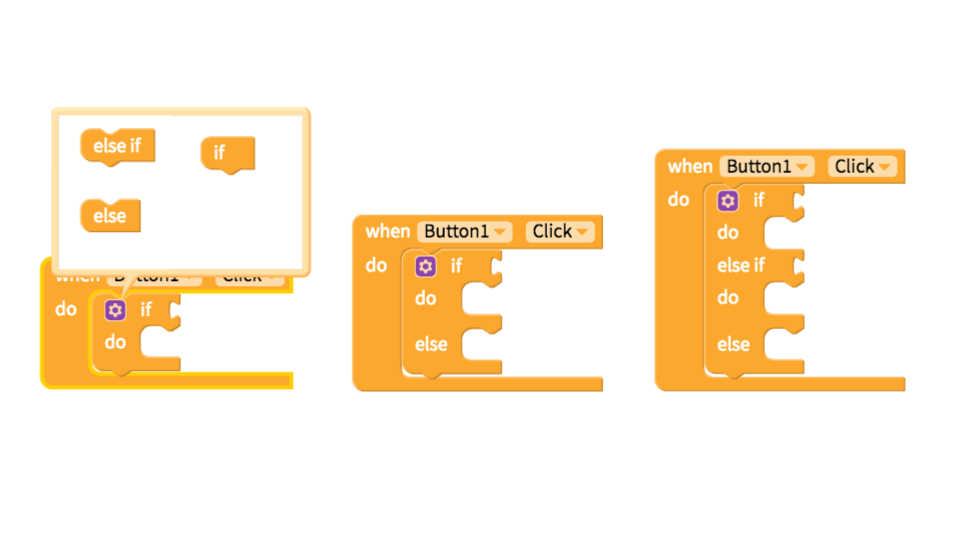
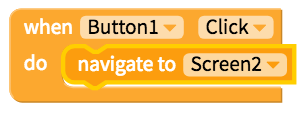
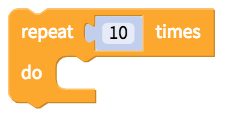
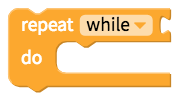

# Control

## If `this`, do `that`

In most apps, one event leads to another event if a condition is met. To specify these scenarios, the `this`, do `that` block is commonly used with [Logic](logic.md) blocks that define the conditions that lead one event to the next.

The if `this`, do `that` block can be transformed to support more complex logic

## Open a screen

You can manage much of your screen navigation through our [Tab](../components/layout/tab-navigator.md), [Drawer](../components/layout/drawer-navigator.md) and [Stack](../components/layout/stack-navigator.md) navigator components but for simple screen navigation, you can use the very popular block below

## Open an installed app by deep link

A user can open an app installed on their phone by clicking a deep link either for Android and iOS. To find deep links for commonly installed apps, you can use this helpful site for social media apps called [URL genius](https://app.urlgeni.us/#/).

You can also use this block to open a URL in the browser.

## Repeat an event

## Repeat an event with a loop

