# Spreadsheet

Airtable is a service that looks like a spreadsheet but actually acts like a database so it can do database-like things like store attachments i.e. images in your spreadsheets \(and not just text\) and link records between spreadsheets.

We like Airtable because set-up is relatively a breeze for a spreadsheet

* [Set up](spreadsheet.md#set-up)
* [Getting, uploading, updating and deleting data](spreadsheet.md#getting-uploading-updating-and-deleting-data-in-a-spreadsheet)

## Set up

### Create your [free Airtable](https://airtable.com/) spreadsheet and account

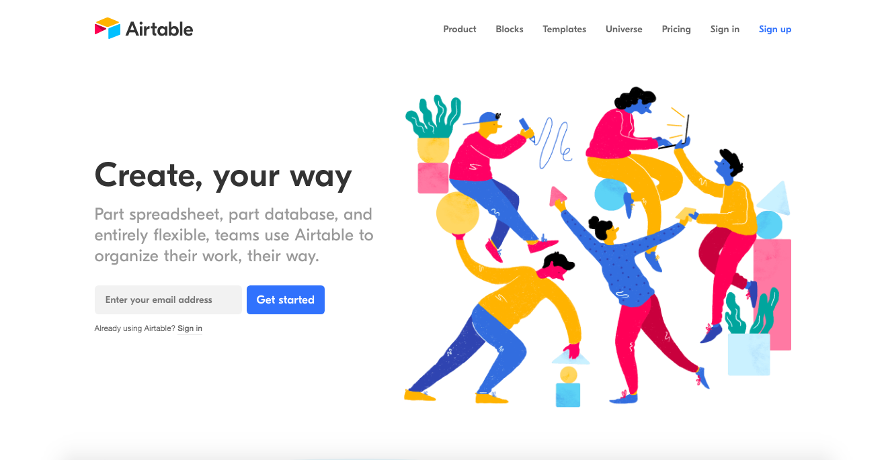

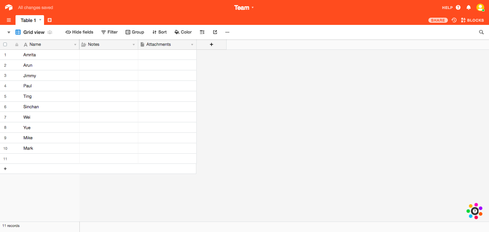

### Connect your Airtable spreadsheet with Thunkable

There are four properties that you need to retrieve from Airtable to connect it with Thunkable: `API key`, `Base ID`, `Table Name` and `View Name`

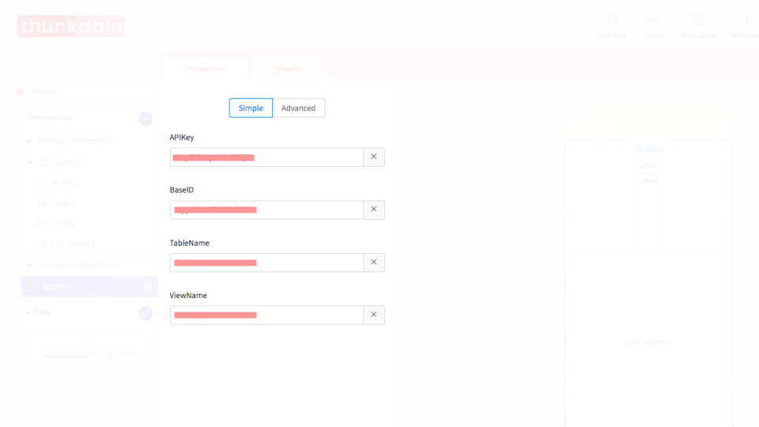

`API key`

To retrieve the API key, you'll have to navigate to the Account page and generate an API Key

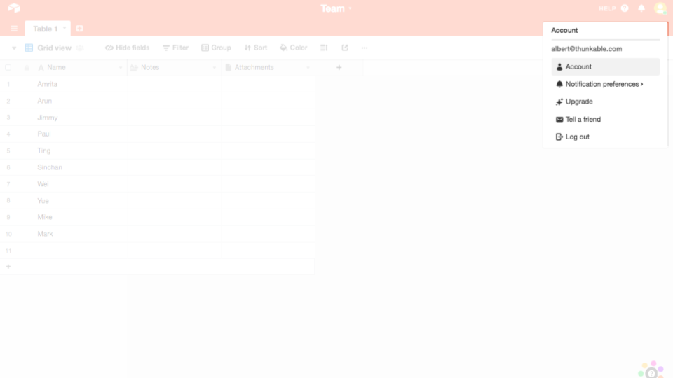

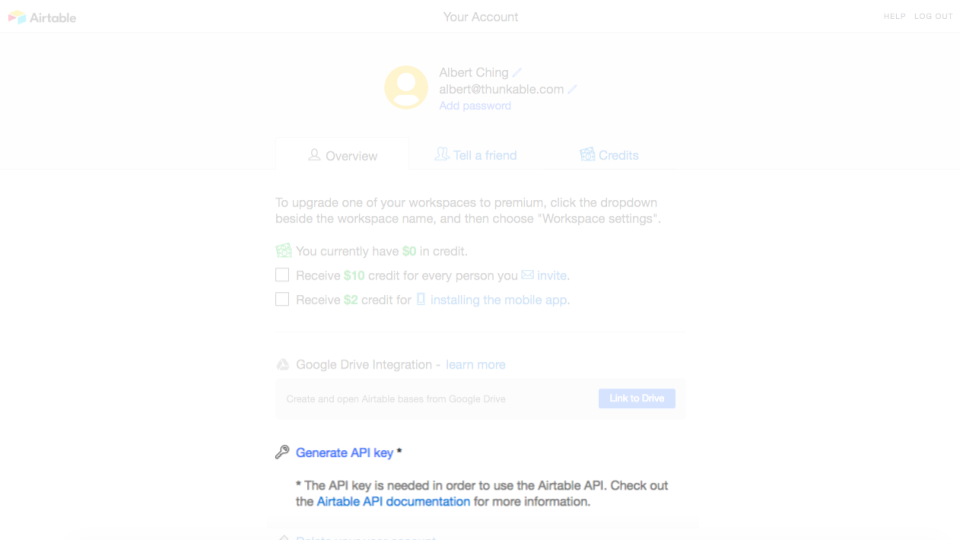

`Base ID`

To retrieve the Base ID, you'll actually have go to the [Airtable API documentation](https://airtable.com/api) page and select your spreadsheet. You'll then have to select the Node.js tab of the code editor and find the Base ID in the code as shown below

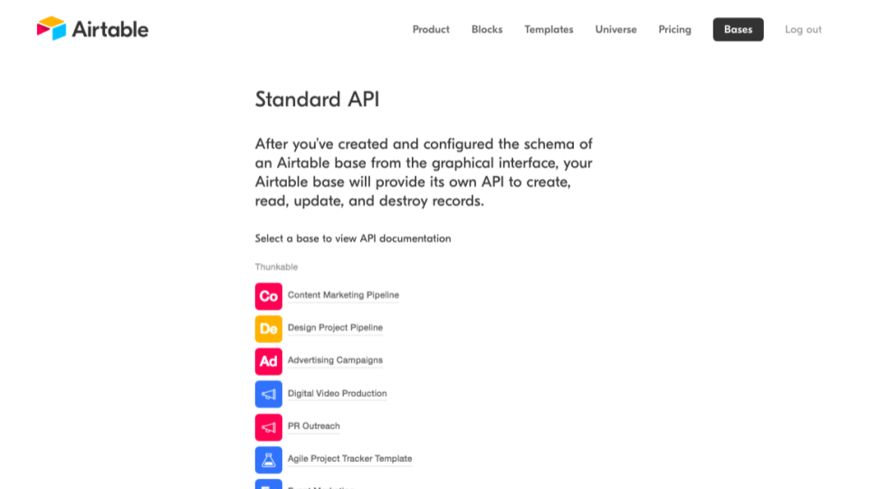

`Table Name` and `View Name`

The Table Name and View Name can be retrieved by grabbing the fields from your spreadsheet as shown below

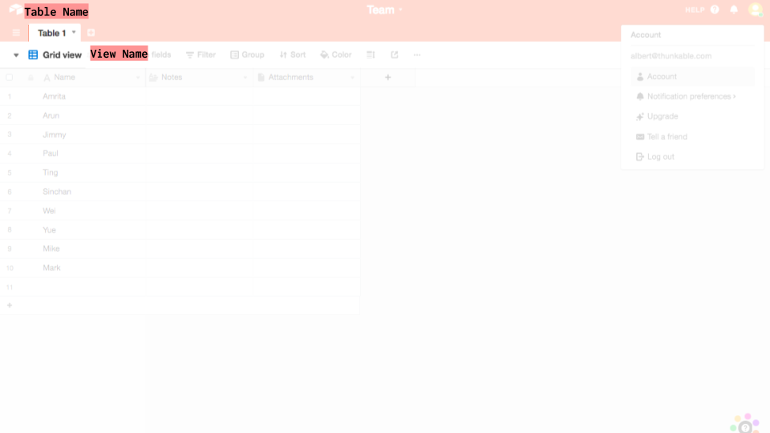

## Getting, uploading, updating and deleting data

### Getting data

#### Getting items for a ListView from an Airtable column

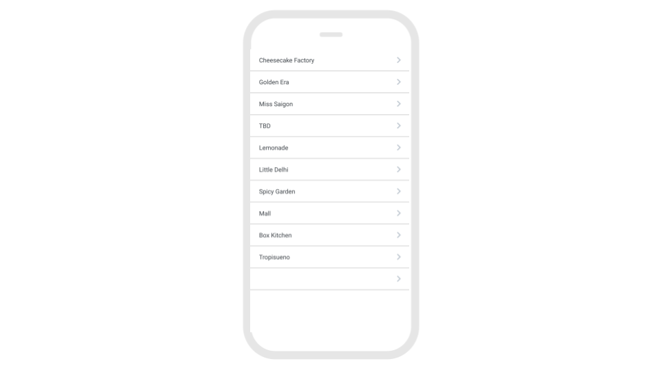

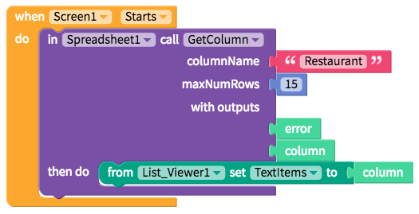

| Event | Description |
| :--- | :--- |
| Get Cell \(`rowNum`, `columnName`\) | Returns the `value` of a specific cell |
| Get Column \(`columnName`, `maxNumRows`\) | Returns a `column` as a list |
| Get Row \(`rowNum`\) | Returns a row  `value` as an object |
| Get All Rows | Returns `rows` as an object |
| Get Selected Rows \(`startingRowNumber`, `numRows`\) | Returns `rows` as an object based on a specified `startingRowNumber` and `numRows` |

### Uploading and updating data

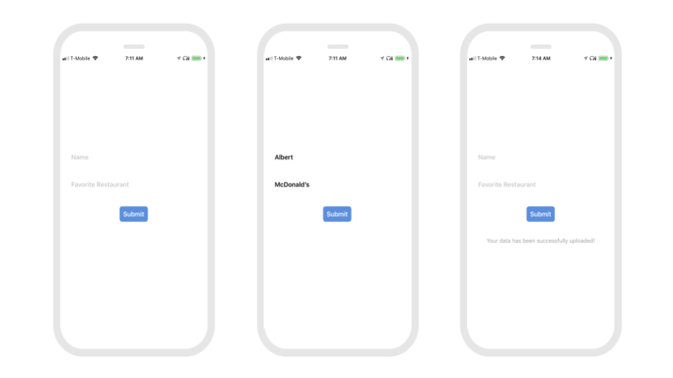

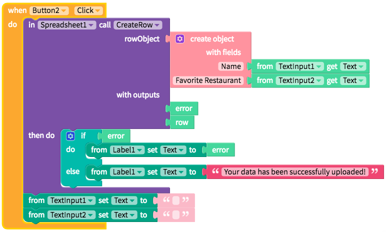

| Event | Description |
| :--- | :--- |
| Create Row \(`rowObject`\) | Uploads a new row of data based on a `rowObject` |
| Set Cell \(`rowNum`,`columnName`,`value`\) | Updates the `value`of a cell in a particular `rowNum` and `columnName` |
| Update Row \(`rowObject`\) | Updates a row based on a `rowObject` |
| Update Row Num \(`rowNum`, `rowObject`\) | Updates a row based on a `rowObject` and a `rowNum` |
| Replace Row Num \(`rowObject`\) | Replaces a row based on a `rowObject` |
| Replace Row \(`rowNum`, `rowObject`\) | Replaces a row based on a `rowObject` and a `rowNum` |

### Deleting data

| Event | Description |
| :--- | :--- |
| Delete Row Num \(`rowNum`\) | Deletes a row based on `rowNum` |
| Delete Row \(`rowNum`, `rowObject`\) | Deletes a row based on a `rowObject` and a `rowNum` |

