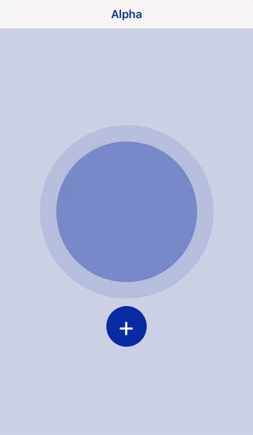
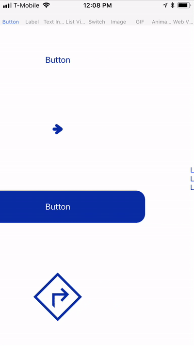
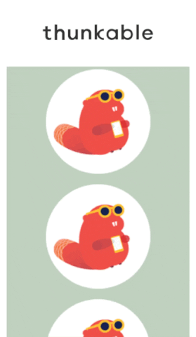
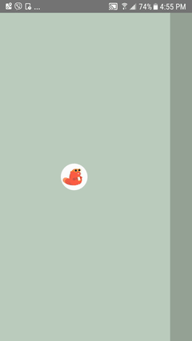
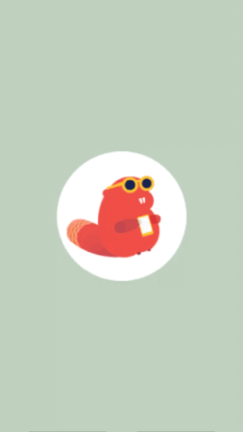

# Design Templates

## 

Almost any design that a modern app developer can make is possible ****on Thunkable ✕. Below are some of the most popular user interfaces that you may want to incorporate into your app.

## Popular

### Stackable

If you ever wondered how [Stack](../create/components/layout/stack-navigator.md) navigators work in an app, this template called Stackable should give you a good glimpse at what is currently possible. It displays the Header bar that is created as well as a top to bottom model transition that you can set. This template also displays some of our favorite Animations powered by [Lottie](../create/components/image/lottie.md) and the [Lottie community](https://www.lottiefiles.com/community). You can actually customize the colors of their animations with their built-in editor.

[**Click to copy**](https://goo.gl/nm7FGv)

### User Interface

There is a lot of design that you can do on the Thunkable platform and the User Interface template shows you some of the possibilities. All the visible components are displayed on a screen of their own in as many useful variations as we can think of

[**Click to copy**](https://goo.gl/VHK9sP)

### Scrollable Screen

A Scrollable screen can be made by setting Scrollable to `true` in a Screen or Column and setting the height to `Fit contents`. Elements within the Screen or Column have to be sized with heights in absolute pixels which together exceed the height of the Screen or Column. For example, an iPhone 6 has a Screen height of 648 px so elements within it will have to collectively exceed that number for the elements to scroll. We also set the minWidth to `100%` of the Column in the advanced properties so that the scrolling Column does not move from left to right.

#### [Click to copy](https://goo.gl/C3hmvg)

### Swipeable Screens

Swipeable screens can be made by dropping Screens within a Tab navigator, setting SwipeEnabled to `false` in the Tab propeties and setting TabVisible to `false` in the Screen properties

#### [**Click to copy**](https://goo.gl/cdvEoG)

### Branding Screen

A Branding screen can be made setting a Timer to fire after `3000` milliseconds and navigate to the second screen

#### [**Click to copy**](https://goo.gl/p2k7uX)

### Sign In screen

A sign in screen allows your users to sign into your app. This can be very helpful in creating individual profiles and increased security. PLEASE NOTE: You will need to create a Firebase account and link it with your sign in screen for this to work. Click [here](https://docs.thunkable.com/thunkable-cross-platform/create/components/sign-in/sign-in) for a walkthrough.

#### \*\*\*\*[**Click to copy**](https://x.thunkable.com/copy/812bb56485b649ac3094e08182d283d7)\*\*\*\*

