# Publish

## Minimum requirements

Before you get started publishing your app, please checkout the minimum requirements for each store below:

### Play Store \(Android\)


As of Aug 1, 2018, Google is requiring all _new_ apps uploaded to the Play Store to be [compatible with Android 8.0](https://developer.android.com/about/versions/oreo/android-8.0-migration) \(aka API 26\). Due to unforeseen circumstances, we will likely miss this deadline by up to a few weeks. If you are planning to publish a new app to the Play Store in the next few weeks, we highly recommend that you upload a version before Aug 1, as existing apps do not need to be compatible with Android 8.0 till Nov 1, 2018. We deeply apologize for the inconvenience.


* Google Play Developer Account \($25 one-time fee\)
* Design assets
  * Icon \(512 x 512 px\)
  * App screenshots
  * Feature graphic \(1024 x 500 px\)
* Privacy policy \(for certain apps that require sensitive information e.g. access to phone camera\)

### App Store \(iOS\)

* Apple Developer Program Membership \($99 / year\)
* Design assets
  * Icon \(1024 x 1024 px\)
  * iPhone and iPad screenshots


The App Store review is typically more rigorous than the Play Store review but both stores are continually raising the bar for what can be listed in their stores.


## Publish to the Play Store \(Android\)


As of Aug 1, 2018, Google is requiring all _new_ apps uploaded to the Play Store to be [compatible with Android 8.0](https://developer.android.com/about/versions/oreo/android-8.0-migration) \(aka API 26\). Due to unforeseen circumstances, we will likely miss this deadline by up to a few weeks. If you are planning to publish a new app to the Play Store in the next few weeks, we highly recommend that you upload a version before Aug 1, as existing apps do not need to be compatible with Android 8.0 till Nov 1, 2018. We deeply apologize for the inconvenience.


Publishing your app to the Play Store is a relatively straightforward and quick process and will help your app reach 2 billion active Android devices.


Success on Google Play starts with quality. The best apps and games have higher ratings, more installs, and more engagement. We recommend visiting the [Play Store Developer Policy Center](https://play.google.com/about/developer-content-policy/#!?modal_active=none) before you submit your app to the Play Store


### Sign up for a [Google Play Developer Account](https://play.google.com/apps/publish/signup/) \(currently one-time fee of $25\)

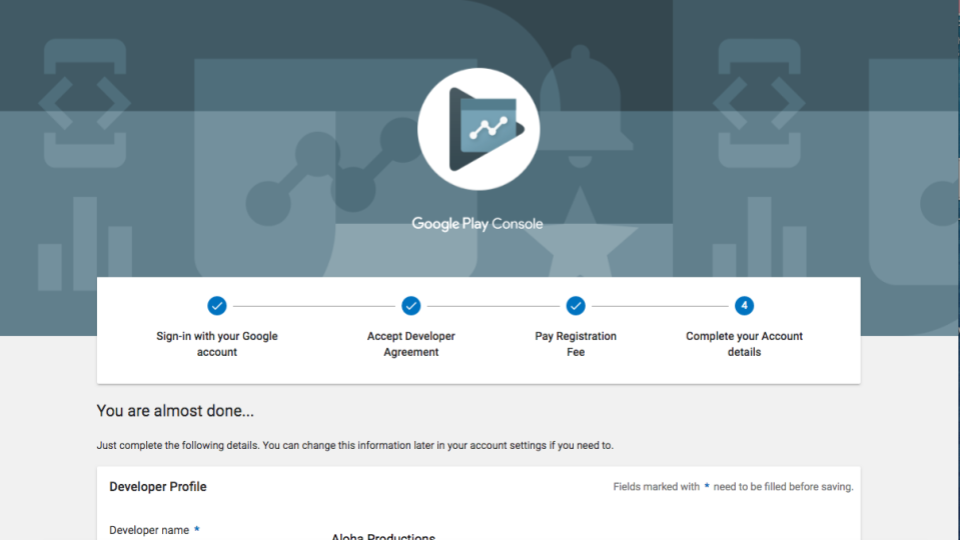

### Update your App Publish settings on Thunkable

To publish your app on Android, you'll need to add an `app icon`, a `name`, a `package name` and an app `version`. To find the App settings, click on the App Icon on the top left.

For recommendations on your `app icon` and `name`, [please see this guide](create/app-icon-+-name.md).

Each Android app that is published to the Play Store has a unique `package name`. Currently, you can enter this in the App \(Bundle\) ID field. 


If you are only publishing to the Play Store, you do not need to enter a Team ID to publish to the Play Store \(this is for iOS only\)


Before you download your app, make sure you set the appropriate Build and Version Number. Google Play requires each new version of your app to have a unique and sequentially higher Build and Version Number. You can also let Thunkable auto-increment \(or automatically increase\) the build and version numbers for you.

### Download your Android app on Thunkable

Select Download Android App and an .apk file will be generated on your desktop

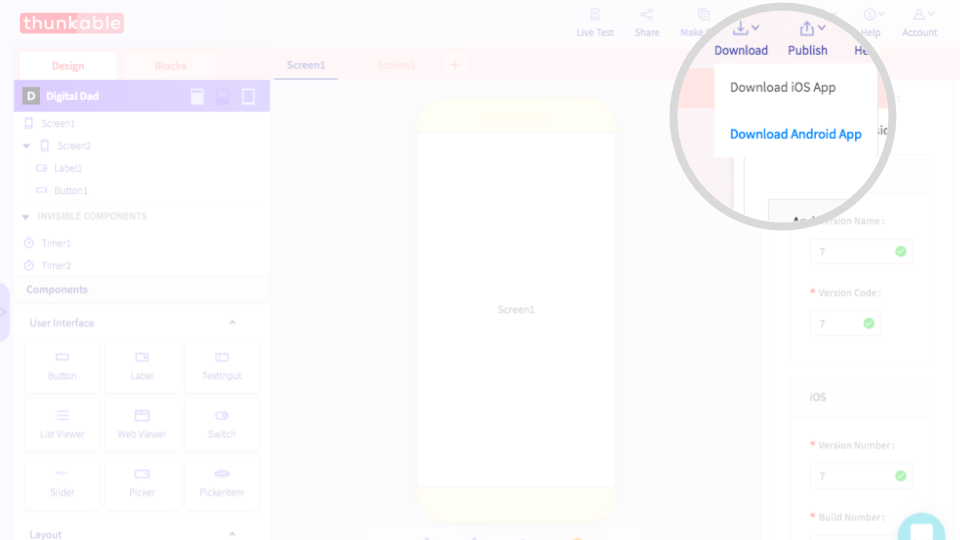

### Create a new app on the Google Play Developer Console

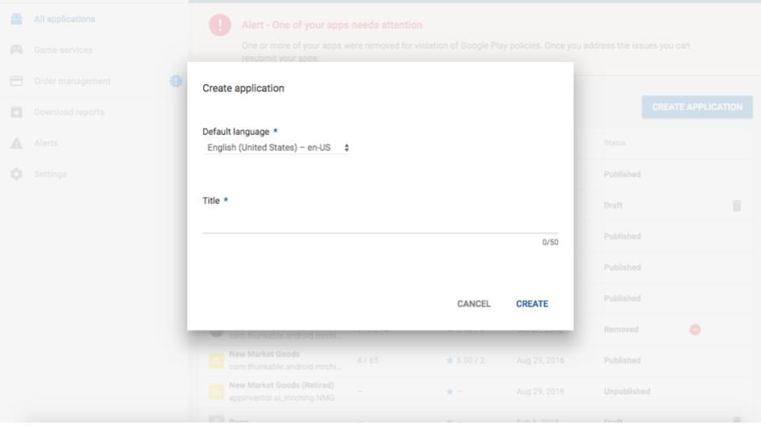

Next, create a new release. This is where you'll upload the latest version of your app \(.apk\)


Enable Google Play App signing. This is an optional program but we recommend it for most use cases.


Drag and drop your app \(.apk\) to the console

### Update your Play store listing

To complete your Play Store listing, you will have to fill out a content rating questionnaire and set pricing and availability. In addition you will need to add a minimum of 4 design assets - two screenshots, a higher resolution icon \(512 x 512 px\) and a feature graphic \(1024 x 500 px\) that shows up on the Play Store app.

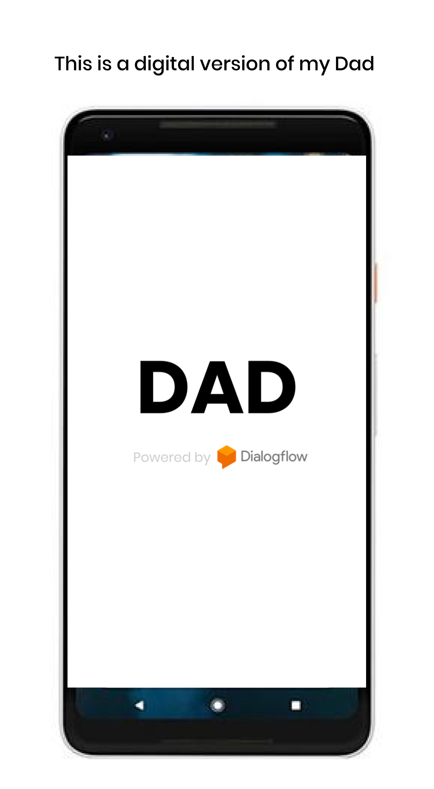

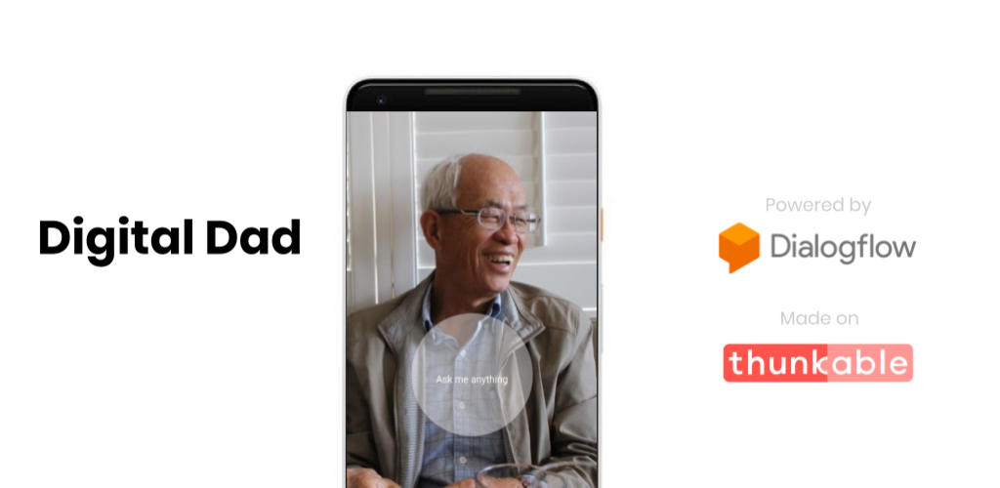

### Add a privacy policy


Apps that request access to sensitive permissions or data \(as defined in the [user data policies](https://play.google.com/about/privacy-security-deception/user-data/)\) are required by the Google Play Store to include a privacy policy. Currently all apps made on Thunkable request access to sensitive permissions or data, which means you will need to provide a privacy policy


**Congrats! You are now ready to submit to the Play Store.**

### Troubleshooting

**You cannot update an existing app on the Google Play Store**

* If you updating an existing app on the Google Play Store, your app will need to have the i\) [same package name](create/package-name-+-bundle-id.md), ii\) a higher or incremented version number, and the iii\) same keystore. The first two are easily editable in the App Settings page but the keystore is not yet able to be imported / exported. 
* Copied apps within an account \(using the [Make Copy](create/make-copy.md)\) will keep the same keystore as the original app. Apps that are copied from a [Share copy](share.md#share-a-fully-editable-copy-of-your-app-project) link will not have the same keystore. Apps from the [Thunkable Classic platform](../thunkable-classic-android/) cannot yet be updated since it is not yet possible to import the keystore.  

## Publish to the App Store \(iOS\)

For app developers looking to distribute their apps to a premium audience, publishing your app to the App Store can be a very rewarding process.

Thunkable has eliminated a few steps from the normal iOS submission process to make it easier for our developers. We send new versions of your app directly to iTunes Connect, Apple's portal for managing App Store submissions, auto-increment each new version and enabling building apps from non-Mac computers \(usually a Mac is required\).


Apple holds a high standard for apps that are approved for distribution in the App Store so please [review Apple's policies and guidelines](https://developer.apple.com/app-store/review/guidelines/) to make sure your app is in compliance before you sign up for the Apple Developer Program


### Enroll in the [Apple Developer Program](https://developer.apple.com/programs/) \(currently $99/year\)

### [Register an App ID](https://developer.apple.com/account/ios/identifier/bundle/create) in your Apple Developer account

Apple will automatically generate a `Team ID` . . .

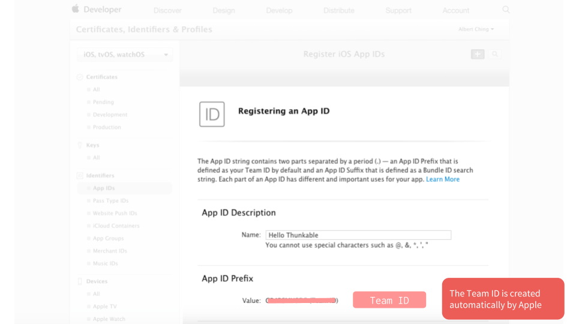

and you will create a `Bundle ID`

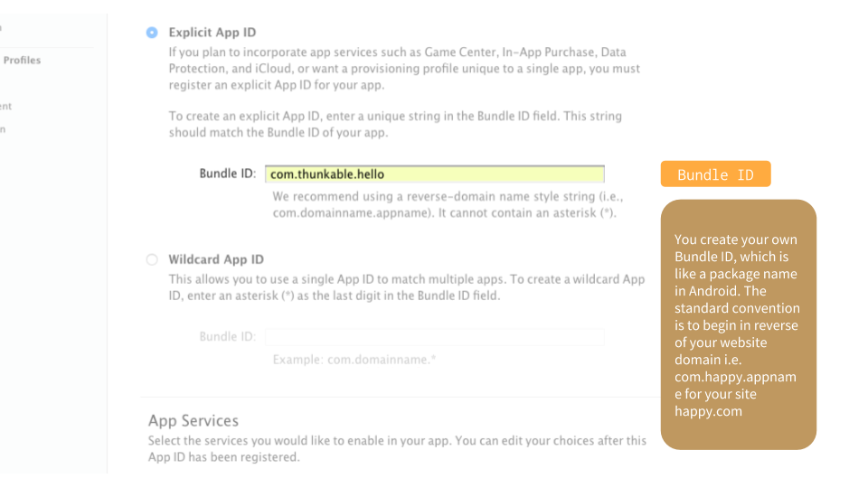

### [Create a new app](https://itunesconnect.apple.com/) in iTunes Connect

iTunes Connect is your portal for managing your submission to the App Store

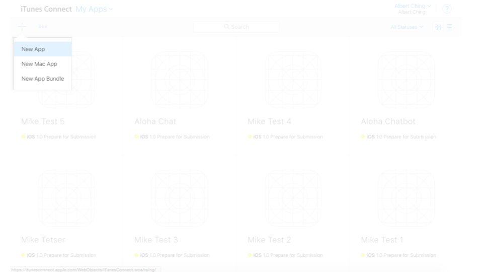

You will need to link the `Bundle ID` you created earlier

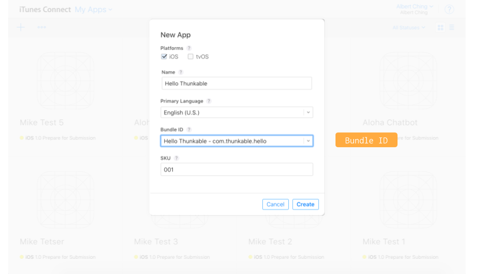

### Update your App Publish settings on Thunkable

To find the App settings, click on the App Icon on the top left.

**IMPORTANT Make sure your icon does not have any transparency in it otherwise Apple will not be able to accept it.** For more recommendations on App Name and Icons, please [visit this page](https://github.com/thunkable/thunkable-docs/tree/4a752596e288fca776105e94dc5e863bb9a3e25a/x/create/app-icon-+-name.md)

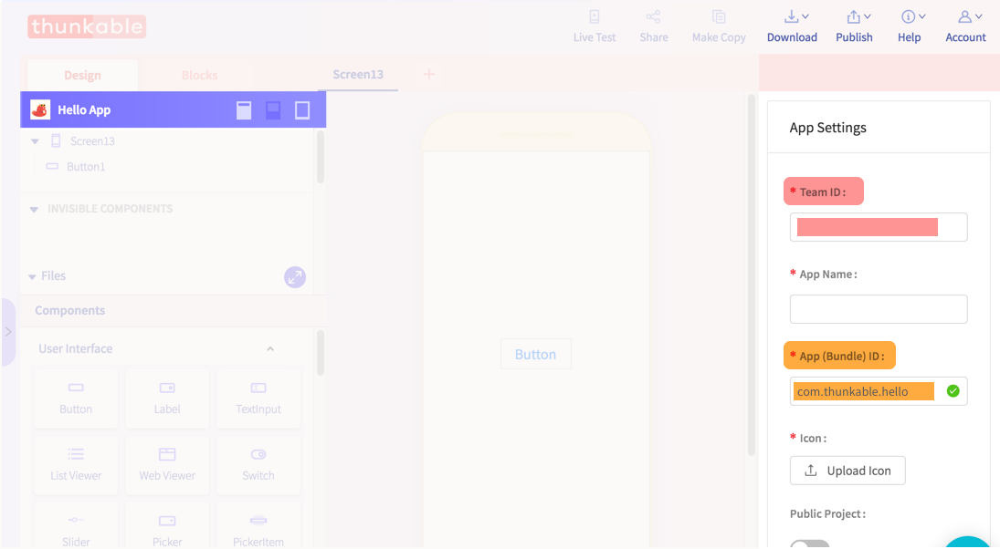

### Send your app to iTunes Connect on Thunkable

Before you send your app to iTunes Connect, make sure you set the appropriate Build and Version Number. Apple requires each new version of your app to have a unique and sequentially higher Build and Version Number. You can also let Thunkable auto-increment \(or automatically increase\) the build and version numbers for you.

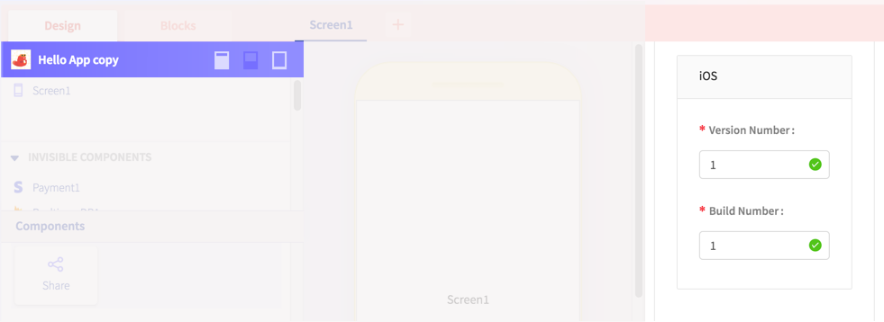

To send your app to iTunes Connect, you'll simply select Publish to App Store and enter your Apple developer login credentials

#### Wait \(up to an hour\)

You may have to wait up to an hour for the app to be successfully sent to iTunes Connect since we have to build the app and it must go through the Apple submission process.

#### Success!

If your app has been successfully uploaded, you will receive an email from iTunes Connect.

Your latest build will appear under the Testflight tab in your iTunes Connect dashboard. Testflight is a tool from Apple that allows you to test your app before it is submitted for release in the App Store. You can use the tool to share your app with others.

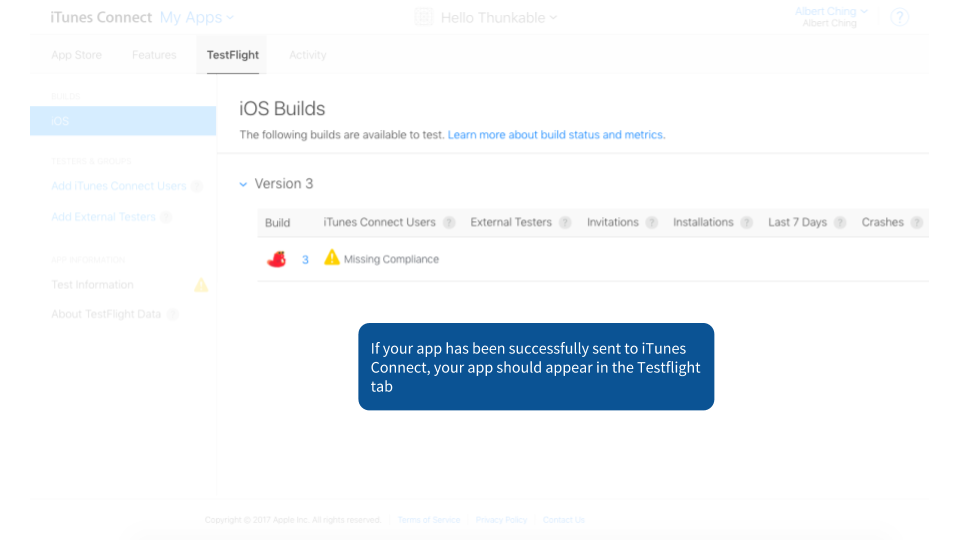

You may need to answer a question about export compliance. You can select 'no' when asked if you app uses encryption since apps made on Thunkable for iOS do not at the moment.

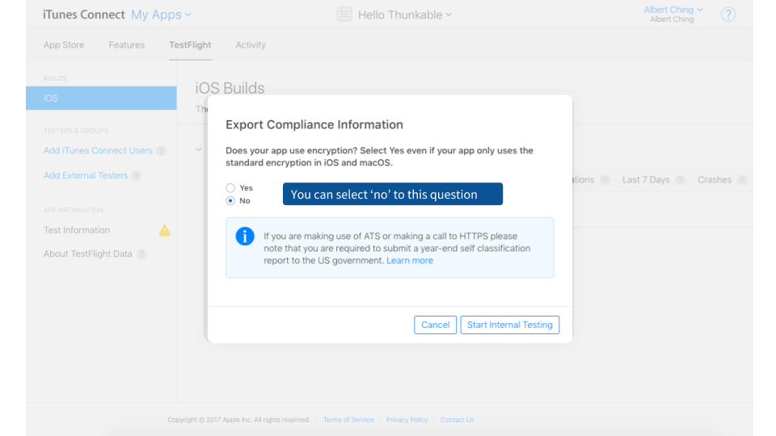

Your app is now ready for internal testing to be downloaded by you and others and ready to submit to the App Store. We recommend you test your app via Testflight before you submit your app for review to the App Store.

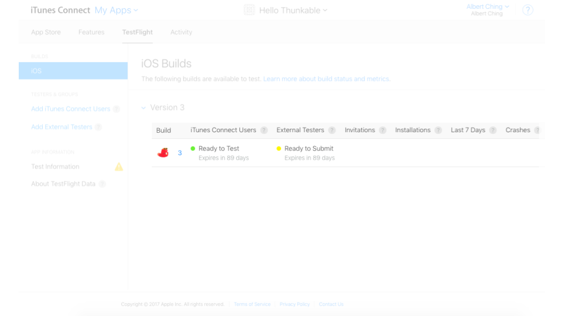

### Troubleshooting

**You do not see your app uploaded to iTunes Connect**

* Download. One way to check if your app is build-able is to download it to your phone first. Two common download errors are:
  * You uploaded an icon that has the same name as an existing asset that you have uploaded
  * Your app icon is not an image file
* Icons. Apple additionally does not allow you to have any icons with any transparent colors. We recommend app icons to be 192 x 192 px
* Membership. To publish to the App Store, you'll need to sign up for [Apple Developer Program Membership](https://developer.apple.com/programs/). This currently costs $99 / year.
* iTunes Connect. Make sure to [follow this step](publish.md#step-③--create-a-new-app-in-itunes-connect) on creating a new app on iTunes Connect
* Certificates. If you have an existing Apple Developer Program account with 2 iOS certificates, you'll have to revoke one. Apple only allows developers to have 2 iOS certificates at a time and Thunkable creates one when it publishes to your account
* Provisioning profile. After you revoke your certificate, it is possible that one or more of your provisioning profiles will become inactive.  To publish successfully, you'll also need to delete any inactive provisioning profiles
* Two-factor authentication. You must turn off 2 factor authentication for your Apple Developer ID to publish with Thunkable
* Login. Apple ID or password were entered incorrectly.  Since we don't store either one, there's no easy way for us to check so enter it slowly

### Submit your app for review

There are 3 main sections to fill out.

The first section is **App Information** which is pretty straightforward.

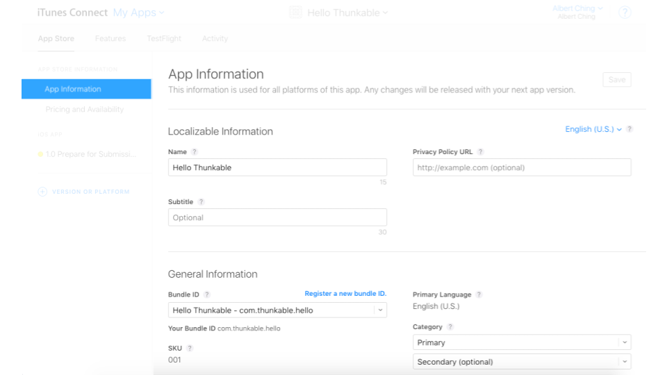

The second section is **Pricing and Availability**. Also, very straightforward although there may be some strategy involved if you want to slowly release your app to different app stores \(New Zealand is a popular first country to launch in\).

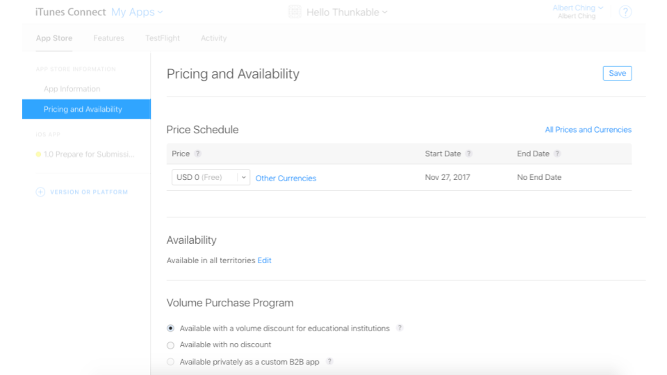

The final section contains the design assets \(**Screenshots, App Icon**\) which you will need to have ready.


For the App Store, iOS requires you to submit an additional app icon with no transparency at sized at 1024 x 1024 px. To generate this icon, we recommend a tool [like this](https://makeappicon.com/) to generate this icon



By default, Thunkable submits your app to be available for both iPhone and iPad so you'll have to submit screenshots for both iPhone and iPad. **** For generating screenshots, we recommend a tool [like this](https://shotbot.io/?utm_source=makeappicon&utm_medium=web&utm_campaign=makeappicon)


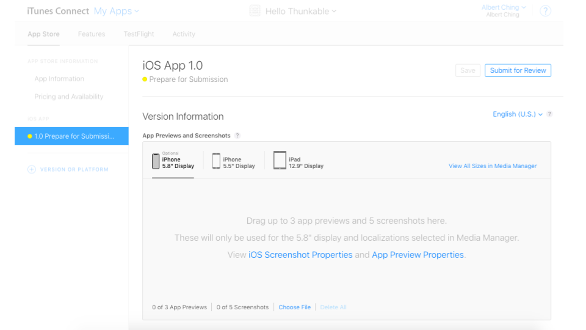

You'll also need to select the build version that you want to submit.

#### Congrats! You are now ready to submit to the App Store.

