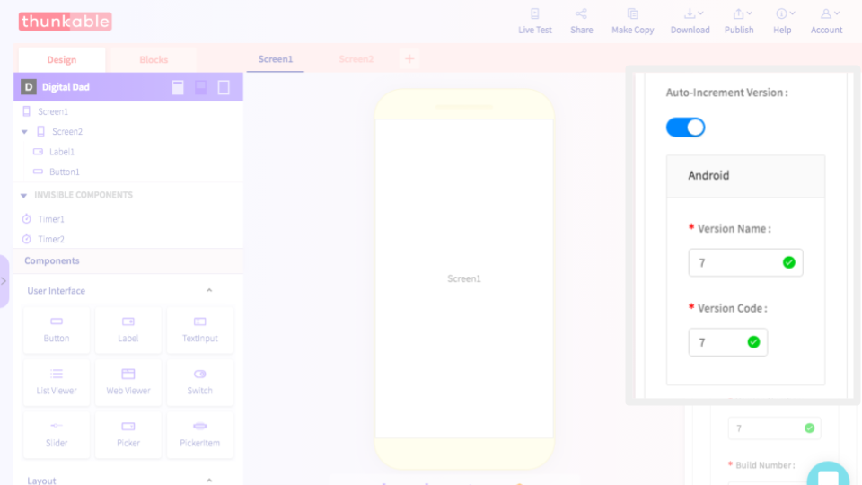
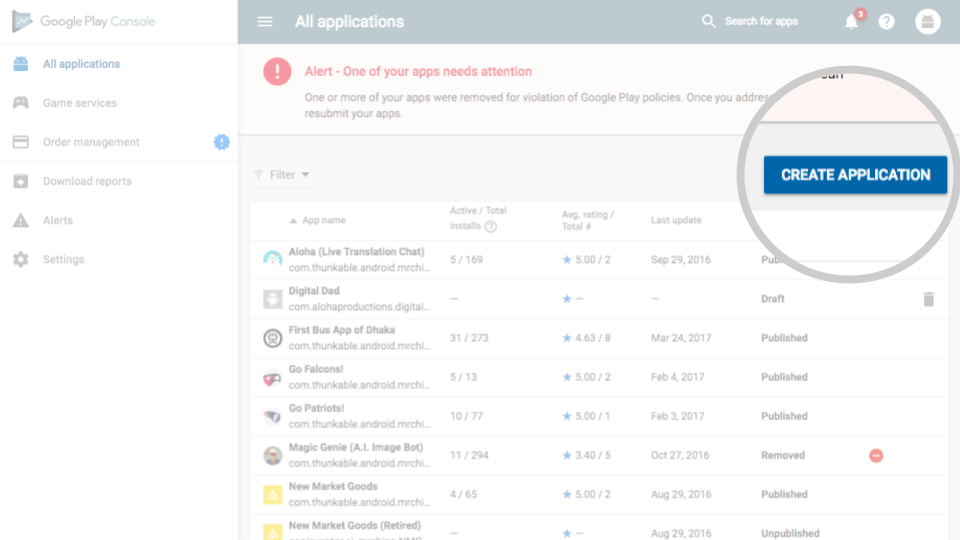
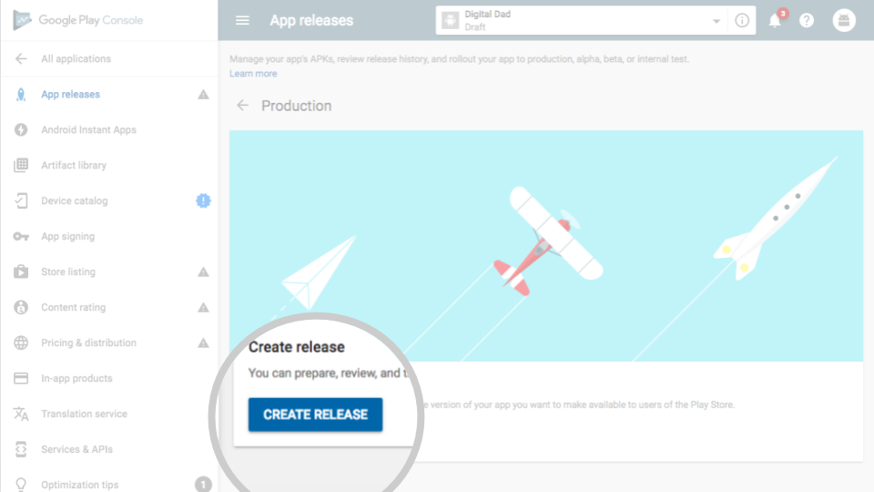

# Publish to Play Store \(Android\)

Publishing your app to the Play Store is a relatively straightforward process and will help your app reach 2 billion active Android devices.


Success on Google Play starts with quality. The best apps and games have higher ratings, more installs, and more engagement. We recommend visiting the [Play Store Developer Policy Center](https://play.google.com/about/developer-content-policy/#!?modal_active=none) before you submit your app to the Play Store


* [Minimum requirements](publish-to-play-store-android.md#minimum-requirements)
* [App info](publish-to-play-store-android.md#app-info)
* [Download your Android app](publish-to-play-store-android.md#download-your-android-app)
* [Submit your app for review](publish-to-play-store-android.md#submit-your-app-for-review)
* [Troubleshooting](publish-to-play-store-android.md#troubleshooting)

## Minimum requirements

* Google Play Developer Account \($25 one-time fee\). Don't have an account? [**Sign up here**](https://play.google.com/apps/publish/signup/)\*\*\*\*

There are a few additional requirements for the Play Store submission that do take time to create:

* Design assets
  * Icon \(512 x 512 px\)
  * App screenshots
  * Feature graphic \(1024 x 500 px\)
* Privacy policy \(for certain apps that require sensitive information e.g. access to phone camera\)

## App info

To publish your app on Android, you'll need to add an `app icon`, a `name`, a `package name` and an app `version`. To find the App settings, click on the App Icon on the top left.

For recommendations on your `app icon` and `name`, [please see this guide](../create/app-icon-+-name.md).

Each Android app that is published to the Play Store has a unique `package name`. Currently, you can enter this in the App \(Bundle\) ID field. 


If you are only publishing to the Play Store, you do not need to enter a Team ID to publish to the Play Store \(this is for iOS only\)


Before you download your app, make sure you set the appropriate Build and Version Number. Google Play requires each new version of your app to have a unique and sequentially higher Build and Version Number. You can also let Thunkable auto-increment \(or automatically increase\) the build and version numbers for you.

## Download your Android app

## Submit your app for review

### Create a new app on the Google Play Developer Console

Next, create a new release. This is where you'll upload the latest version of your app \(.apk\)


Enable Google Play App signing. This is an optional program but we recommend it for most use cases.


### Update your Play store listing

To complete your Play Store listing, you will have to fill out a content rating questionnaire and set pricing and availability. In addition you will need to add a minimum of 4 design assets - two screenshots, a higher resolution icon \(512 x 512 px\) and a feature graphic \(1024 x 500 px\) that shows up on the Play Store app.

### Add a privacy policy


Apps that request access to sensitive permissions or data \(as defined in the [user data policies](https://play.google.com/about/privacy-security-deception/user-data/)\) are required by the Google Play Store to include a privacy policy. Currently all apps made on Thunkable request access to sensitive permissions or data, which means you will need to provide a privacy policy


**Congrats! You are now ready to submit to the Play Store.**

## Troubleshooting

**You cannot update an existing app on the Google Play Store**


Apps originally built on the [Thunkable Classic platform](../../thunkable-classic-android/) cannot be updated since it is not yet possible to import the keystore


* If you updating an existing app on the Google Play Store, your app will need to have the i\) same package name, ii\) a higher or incremented version number, and the iii\) same keystore. The first two are easily editable in the App Settings page but the keystore is not yet able to be imported / exported. 
* Copied apps within an account \(using the [Make Copy](../make-copy.md)\) will keep the same keystore as the original app. Apps that are copied from a [Share copy](../share.md#share-a-fully-editable-copy-of-your-app-project) link will not have the same keystore. Apps from the [Thunkable Classic platform](../../thunkable-classic-android/) cannot yet be updated since it is not yet possible to import the keystore. 

