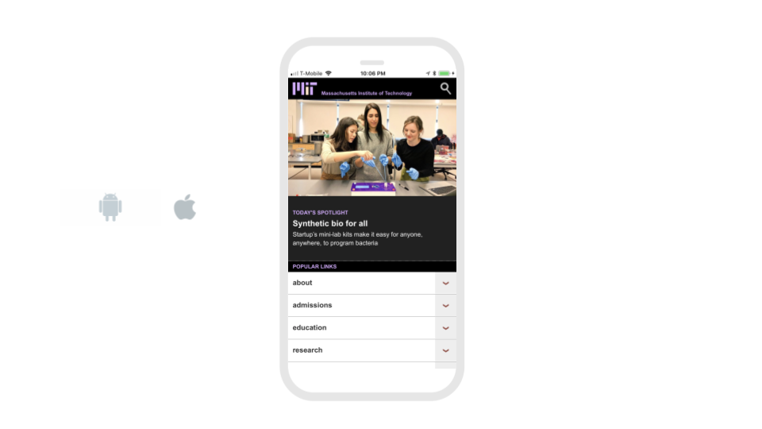

# Web Viewer


When publishing an app containing a Web Viewer, you may see a message saying that your Web Viewer has a "deprecated API". We are working on updating this component.   
The Web Viewer API will be brought up to date before the Play Store or App Store stops accepting the deprecated API.


* [Set URL](web-viewer.md#set-url)
* [Edit Web Viewer size](web-viewer.md#edit-web-viewer-size)
* [Add spacing](web-viewer.md#add-spacing)
* [Post Message/Receive Message](web-viewer.md#post-message-receive-message)

## Set URL

To open up a website in your app, you need to provide  the Web Viewer with a URL. 

A URL is kind of like a street address - it tells the web viewer the location of the website on the internet.

* **URL:** Enter in the link to the website or an image. The URL must include https:// or http://. 

_Note: Can also accept .html files that have been uploaded to the app \(great for offline use\). Additionally, t_he Web Viewer currently permits full-screen viewing of videos on iOS only

## Edit Web Viewer size

You can set how tall the Web Viewer is using the height property and set how wide it is using the width property.

**Height**

* **Fill container -** The Web Viewer fills the entire screen vertically
* **Fit contents -** The Web Viewer’s height changes to fit the contents it contains
* **Relative size -** The Web Viewer fills the specified percentage of the screen
* **Absolute size -** Sizes the Web Viewer to a specified number of pixels

**Width**

* **Fill container -** The Web Viewer fills the entire screen horizontally
* **Fit contents -** The Web Viewer’s width changes to fit the contents it contains
* **Relative size -** The Web Viewer fills the specified percentage of the screen
* **Absolute -** Sizes the Web Viewer to a specified number of pixels

## Add Spacing

You change the spacing and positioning of the Web Viewer with the Margin and Padding properties. 

**Margin**

* You can specify how much space you want between the border and the contents of Web Viewer using either pixel or percent values.

**Padding**

* You can specify how much space you want between the edges of the Web Viewer and the screen using either pixel or percent values.

## Post Message/Receive Message

If you own the website being displayed in your Web Viewer, you can send and receive messages between your website and the Web Viewer using Javascript.

You can see examples of sending/receiving messages and get further setup instructions [here](https://github.com/thunkable/webviewer-extension/).

